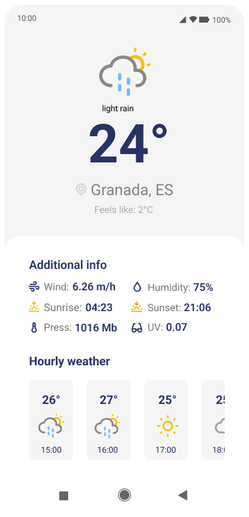
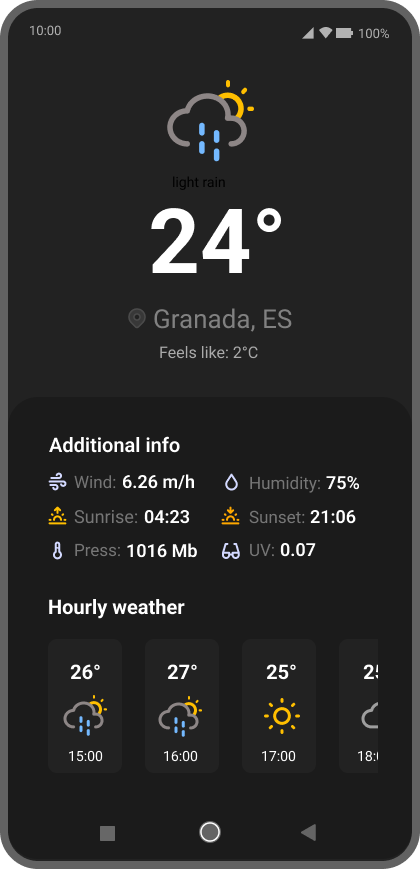
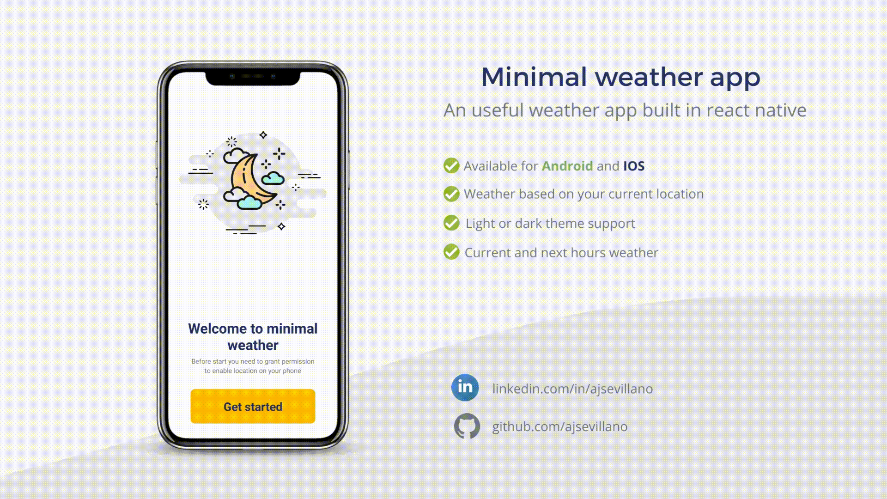

# Minimal Weather App

> A minimalist weather app for Android and iOS built with React Native and Expo.


<p align="center">
  
  &nbsp;&nbsp;&nbsp;&nbsp;
  
</p>

<p align="center"><em>Light and dark theme</em></p>



## About

My first React Native project, built to get hands-on with Expo and mobile development. The goal was to go beyond tutorials and ship something genuinely useful: a clean weather app that works on both Android and iOS. It was a good introduction to mobile-specific concepts like device location, navigation stacks, and adapting UI for different screen sizes and system themes.

## Features

- 🌤️ Real-time weather based on your current GPS location
- 🌙 Light and dark theme following system preference
- ⏱️ Hourly weather forecast
- 💨 Additional data: wind speed, humidity, pressure, UV index, sunrise and sunset
- 📱 Works on Android and iOS

## Tech Stack

| Layer | Technology |
|-------|-----------|
| Framework | React Native 0.76 + Expo 52 |
| Language | TypeScript |
| Navigation | React Navigation v6 |
| Location | expo-location |
| Storage | AsyncStorage |
| Data | OpenWeatherMap API |

## Getting Started

### Prerequisites

- Node.js 18+
- Expo CLI (`npm install -g expo-cli`)
- A free API key from [OpenWeatherMap](https://openweathermap.org/api)

### Installation

```bash
git clone https://github.com/ajsevillano/React-native-weather.git
cd React-native-weather
npm install
```

Create a `.env` file in the root:

```env
API_KEY=your_openweathermap_api_key
```

Run on your device or emulator:

```bash
npx expo start
```

### Building the APK

```bash
eas build -p android --profile preview
```

> This app is not published on the App Store or Google Play. Clone the repo and build it yourself using the steps above.

## Contributing

Found a bug or have an idea? Feel free to open an issue.

## License

MIT
